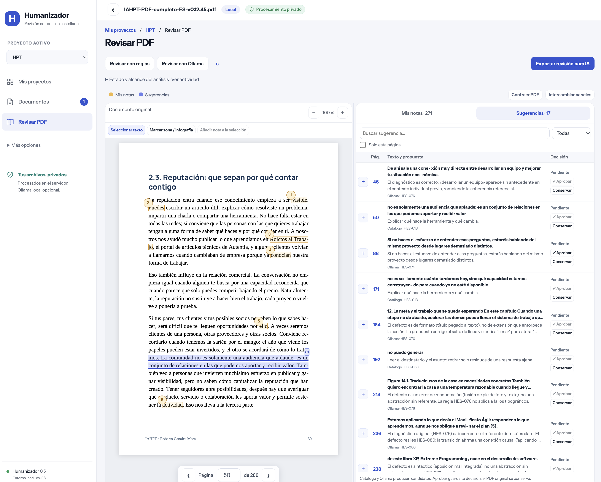

# Humanizador

**Un espacio de revisión editorial para leer, anotar y decidir sobre un PDF.** Gratuito, con reglas en castellano de España y revisión opcional con un modelo local.

[Manual de usuario](https://rcanalescoder.github.io/Humanizador/) · [El proyecto en hardMent](https://hardment.com/proyectos/humanizador.html) · [Proyectos de hardMent](https://hardment.com/proyectos.html)

## Para qué sirve

Una clase, una locución o unas notas personales pueden convertirse en un libro con ayuda de una IA. Durante esa composición se pueden perder sujetos, ejemplos, condiciones, humor o relaciones entre ideas. Humanizador ayuda a localizar pasajes que conviene releer, contrastarlos con el documento y reunir las decisiones del autor.

El objetivo es facilitar la edición y la revisión manual final. No está pensado para plagiar, engañar sobre la autoría ni eludir detectores de IA. Una coincidencia es un **candidato editorial**, no una prueba de que un texto lo haya escrito una máquina. La persona que edita decide qué conservar y qué corregir.



*Captura real de una revisión de IAHPT, utilizada con permiso de su autor, Roberto Canales Mora. El libro completo, sus notas y su base de datos no se distribuyen. [Derechos de las capturas](manual/assets/README.md).*

## Qué puedes hacer

- Crear proyectos y cargar PDF con texto seleccionable; empezar a leer y anotar sin lanzar un modelo.
- Seleccionar frases o marcar zonas e infografías, escribir una nota y conservar su ubicación exacta.
- Pedir una revisión con reglas o con Ollama, de forma explícita; consultar el progreso y los errores.
- Ver notas y sugerencias sobre el mismo PDF y en dos pestañas, con una tabla compacta para aprobar, conservar o reabrir cada propuesta.
- Ajustar el ancho de los paneles, intercambiarlos, contraer el menú o el PDF y cambiar de página desde el propio visor.
- Exportar un único JSON editorial con notas, recortes, sugerencias, decisiones, contexto y referencias para trabajar con otra IA. Exportarlo no envía el documento a ningún servicio.
- Detener la aplicación de forma segura y decidir si continuar los análisis pendientes al volver.

El PDF original permanece intacto. Aprobar una propuesta guarda una decisión; **no reescribe el PDF**. La edición definitiva se hace sobre el manuscrito y se revisa manualmente.

## Reglas y límites

| Parte del catálogo | Estado en la versión 0.5 |
| --- | --- |
| 30 comprobaciones deterministas | Buscan patrones y expresiones sin un modelo |
| 12 criterios editoriales | Revisión contextual opcional con Ollama |
| 38 especificaciones | Documentadas, pendientes de implementación o validación |

Las 80 fichas incluyen orientaciones, excepciones y fuentes; no equivalen a 80 detectores comprobados. El catálogo combina patrones de redacción con criterios de claridad y fidelidad. Las preferencias editoriales incluyen conservar sujeto, escenas, postura, condiciones y grado de certeza, además de releer cada cambio con sus vecinos.

Puede haber falsas alarmas y omisiones. Tener más hallazgos no demuestra mayor calidad. No se ha medido la precisión general en un corpus representativo. Los PDF escaneados necesitan OCR externo; la aplicación no lo incluye. Columnas, tablas y palabras partidas requieren contrastar la extracción con el original. Ollama revisa fragmentos con contexto vecino, no toda la coherencia del libro de una sola vez.

## Tecnología y requisitos

React 19 y Vite 8 para la interfaz; PDF.js 6 para representar y extraer el PDF; Node.js con HTTP nativo, SQLite y un proceso de trabajo independiente para guardar y procesar las revisiones. Las versiones exactas están fijadas en `package-lock.json`.

Necesitas **Node.js 24 o posterior**, npm, Git, macOS o Linux con `sh` y `ps`, y un navegador actual. Los scripts de arranque están orientados a esos sistemas; Windows nativo no se ha validado. La instalación descarga dependencias. La revisión por reglas no necesita Ollama ni una cuenta de IA. Ollama es opcional, necesita un modelo instalado y memoria suficiente para ese modelo; no se descarga al instalar Humanizador.

## Instalación y arranque

```sh
git clone https://github.com/rcanalescoder/Humanizador.git
cd Humanizador
npm ci
./arrancar.sh
```

Se compila la interfaz y se abre el navegador en `http://127.0.0.1:8787/`. Si ese puerto está ocupado, se busca otro y se indica en la web. Ante un fallo de arranque se abre una página local con el diagnóstico. Ejecutar `arrancar.sh` de nuevo detiene su instancia anterior y la reinicia de forma segura.

```sh
./parar.sh
```

Los documentos y decisiones quedan en `data/`, fuera de Git. Si hay una revisión en curso, el trabajo queda en pausa. Al volver puedes continuar desde los fragmentos válidos guardados, cuando la configuración sea compatible, o dejarlo pendiente. Cerrar la pestaña no detiene el servidor.

### Ollama opcional

Instala [Ollama](https://ollama.com/download) y descarga un modelo local compatible. La etiqueta configurada por defecto es `qwen3.6:27b-q8_0`; es un modelo grande, no un requisito para usar las reglas. Para elegir otra etiqueta instalada:

```sh
HUMANIZADOR_OLLAMA_MODEL='etiqueta-local-instalada' ./arrancar.sh
```

Comprueba su disponibilidad en la aplicación y pulsa **Revisar con Ollama** cuando quieras empezar. No se usan APIs de pago. Consulta [configuración, recursos y límites](docs/ollama.md).

## Comandos

| Comando | Función |
| --- | --- |
| `./arrancar.sh` / `./parar.sh` | Arranque con navegador y parada segura de su instancia |
| `npm run dev` | Desarrollo; interfaz en el puerto 5187 y API en 8787 |
| `npm start` | Servidor y worker en primer plano; para supervisión de servidor |
| `npm run build` | Compilar la interfaz en `dist/` |
| `npm test` | Pruebas automatizadas, sin inferencia real |
| `npm run check` | Pruebas y compilación |
| `npm run check:public` | Auditar los archivos del índice Git y los recursos del manual |
| `npm run backup -- /ruta/privada/copia.sqlite` | Copia consistente con PDF, notas y revisiones; conservar fuera de Git |
| `npm run apply -- texto-origen.json cambios.json texto-revisado.txt` | Aplicar operaciones aprobadas al texto, comprobando precondiciones |
| `npm run eval:local -- muestra.json resultado.json` | Evaluación privada con Ollama; consume recursos locales |

No mezcles `npm start` o `npm run dev` con la instancia de `arrancar.sh` sobre la misma base de datos. Consulta [operación y despliegue](docs/operacion.md) antes de exponer el servidor a una red. GitHub Pages aloja el manual; **la aplicación necesita un servidor Node** y no funciona como aplicación estática en Pages.

## Estructura

```text
src/         Interfaz, visor y paneles de revisión
server/      API, SQLite, extracción y trabajos de análisis
core/        Reglas, anclajes, exportación y controles de cambios
rules/es-ES/ Catálogo, patrones y fuentes
evaluation/  Casos sintéticos compartibles
test/        Pruebas automatizadas
tools/       Arranque, copias, aplicación y evaluación
deploy/      Docker Compose y ejemplo de proxy
docs/        Arquitectura, investigación y contratos
manual/      Guía estática y capturas autorizadas para GitHub Pages
data/        Documentos y revisiones locales (ignorado)
privado/     Archivo de trabajo privado (ignorado)
```

## Privacidad, colaboración y licencia

En uso local, los PDF y revisiones se guardan en tu ordenador. Si despliegas en un servidor, se guardan en ese servidor. Ollama solo admite conexión de bucle local y modelos locales. Tú decides si compartes la exportación con otra IA; puede contener texto y recortes del documento.

Para proponer mejoras, abre una [incidencia](https://github.com/rcanalescoder/Humanizador/issues) con un ejemplo sintético, comportamiento esperado y versión. No adjuntes manuscritos, exportaciones reales, bases de datos ni credenciales. [Cómo añadir conocimiento y evaluar reglas](docs/aprendizaje-reglas.md).

Código y documentación propia bajo [licencia MIT](LICENSE). Las dependencias conservan sus licencias. Los fragmentos del libro visibles en las capturas se muestran con permiso y mantienen los derechos de su autor; no forman parte de la licencia del software.

[Arquitectura](docs/arquitectura.md) · [Contrato de cambios](docs/contrato-cambios.md) · [Fuentes](docs/investigacion.md) · [Manual completo](https://rcanalescoder.github.io/Humanizador/)
