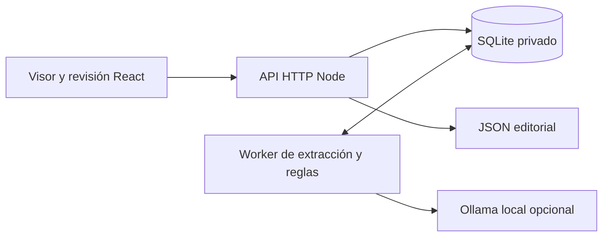

# Arquitectura de Humanizador 0.6

La interfaz React se compila con Vite y usa PDF.js para representar el original, seleccionar texto y anclar las anotaciones. El servidor HTTP de Node recibe los PDF, guarda los datos en SQLite y sirve la interfaz compilada. Un worker separado extrae el texto y ejecuta las tareas; cerrar el navegador no cancela el procesamiento.

## Un documento, un espacio de revisión

Subir un documento permite leerlo y anotarlo antes de pedir análisis. El visor mantiene dos capas: notas del usuario y sugerencias. El panel lateral tiene dos pestañas, con las decisiones en la tabla de sugerencias. El menú se puede contraer; los paneles admiten cambio de ancho y posición. Los controles de página permanecen dentro del visor.

El PDF original es inmutable. Cada anotación guarda texto o región, página, coordenadas, contexto y huellas. Los offsets se cuentan por puntos de código Unicode, con normalización NFC. La exportación editorial reúne notas y sugerencias sin confundir las aprobadas con las pendientes; las operaciones aplicables se someten además al [contrato de cambios](contrato-cambios.md).

## Análisis y recuperación

El worker procesa una tarea cada vez. El catálogo determinista funciona sin modelo. Ollama añade propuestas y comprobaciones editoriales y de fidelidad, con validación de citas, esquemas y anclajes. Las respuestas completas se guardan por fragmento; su reutilización exige compatibilidad de texto, contexto, modelo, prompt y parámetros. Un fallo no se presenta como análisis completo.

El supervisor y los scripts de ciclo de vida identifican sus procesos antes de detenerlos. La parada pausa los trabajos e invalida sus concesiones, conserva el progreso válido y permite elegir la continuación desde la interfaz. Véase [operación](operacion.md).

## Instalación y diagnóstico

`instalar.sh` e `instalar.ps1` comprueban Node y llaman al asistente común `tools/install.mjs`. Las preferencias se guardan de forma atómica en `data/settings.json`; las variables de entorno tienen prioridad. El diagnóstico consulta el catálogo y los metadatos locales de Ollama, sin inferencia. La ayuda integrada comparte las instrucciones por sistema entre el espacio de revisión y Configuración.

## Despliegue y datos

La instalación local escucha en bucle local. Un despliegue remoto necesita Node persistente, almacenamiento para SQLite, contraseña y HTTPS mediante proxy. GitHub Pages sirve únicamente `manual/`; no recibe PDF ni ejecuta la aplicación. Los originales, extracciones, bases, exportaciones e informes privados quedan fuera del código y del build público.

No hay OCR integrado ni edición de la maquetación original. Una revisión semántica requiere juicio humano; los conteos de candidatos no son probabilidades de autoría.
